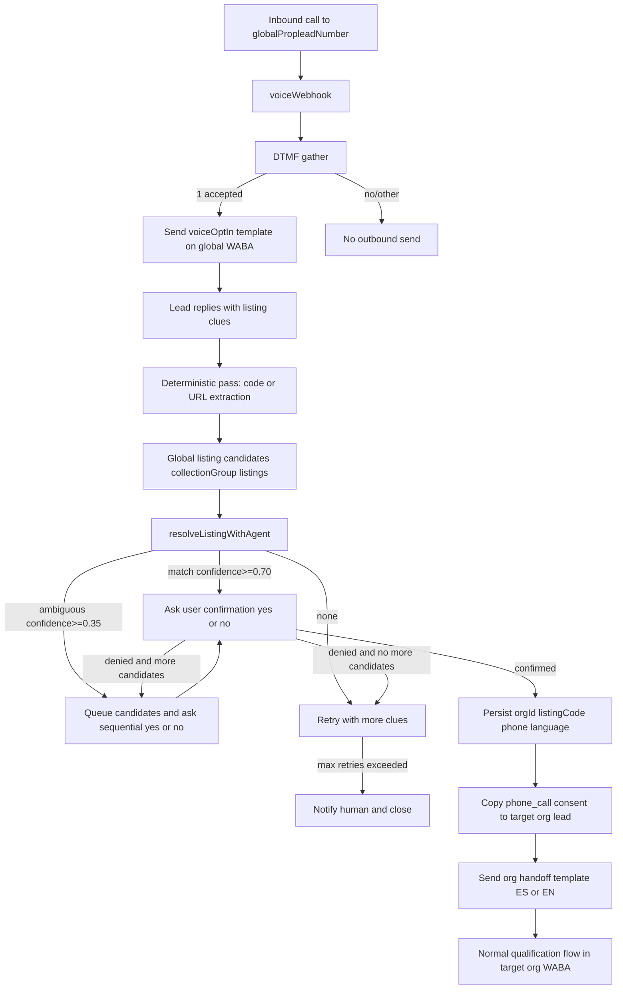

# Two-Stage Call-to-WhatsApp Handoff Plan (Status Copy)

## Goal

Replace phone-based org resolution in the call flow with a deterministic + AI-assisted listing resolution stage on Proplead WABA, then hand off to the matched org WABA with a fresh intro message.

## Update: Unified inbound listing resolution

- The same listing-resolution state machine (`call_listing_collect` -> `call_listing_confirm` -> `qualification`) now also powers inbound WhatsApp after Idealista SMS opt-in.
- The legacy `idealista_confirm` step is removed from runtime onboarding.
- Before any ambiguous candidate yes/no prompts, the assistant now sends an intro message first (ES/EN).
- In strict routing mode, webhook/processBuffer require explicit org context (no chatId-based org fallback).

## Target Flow

## Done

- Removed caller-phone org resolution dependency (`findOrgIdByPhone`) from call intake flow.
- Added dedicated global intake org config (`PROPLEAD_INTAKE_ORG_ID`) for voice call entry.
- Implemented global listing resolution for call flow (cross-org listing candidate pool).
- Implemented confirmed-match handoff from global assistant to target org assistant.
- Added handoff metadata on conversation + call handoff audit collection.
- Implemented inherited call consent (`source: phone_call`) from global org lead to target org lead before template send.
- Added call handoff readiness endpoint: `callHandoffReadiness`.
- Set template SIDs in runtime env:
  - `TWILIO_TEMPLATE_SID_VOICE_OPTIN_CONSENT=HX8da52518b4b16392cffdd1f89dd49b55`
  - `TWILIO_TEMPLATE_SID_CALL_HANDOFF_ORG_ES=HX30e0ded0c2df0f6c43848b00ca01d978`
  - `TWILIO_TEMPLATE_SID_CALL_HANDOFF_ORG_EN=HX029df4498e7f291754fdb5eec601661e`
- Added language-based Twilio handoff template selection:
  - EN uses `TWILIO_TEMPLATE_SID_CALL_HANDOFF_ORG_EN` (fallback ES/initial),
  - ES uses `TWILIO_TEMPLATE_SID_CALL_HANDOFF_ORG_ES` (fallback initial).

## AI Resolver (Implemented)

The call flow now uses a global AI resolver pipeline (not org-local) before handoff:

- Deterministic first-pass extraction:
  - tries direct listing code / URL extraction from user text.
- Global candidate pool:
  - queries active listings across organizations (`collectionGroup("listings")`),
  - keeps listing + owner org context for downstream handoff.
- AI decision engine:
  - uses `resolveListingWithAgent` to classify `match | ambiguous | none`,
  - handles fuzzy inputs (price shorthand like `2.2k`, misspelled streets, partial zones).
- Decision thresholds:
  - `match` accepted only with confidence >= `0.70`,
  - `ambiguous` accepted only with confidence >= `0.35`,
  - otherwise treated as `none`.
- User confirmation loop:
  - `match` -> asks explicit yes/no confirmation,
  - `ambiguous` -> asks user to pick candidate (`1..5`) or provide more clues,
  - repeated `none` -> controlled retry flow, then human fallback.
- Resolver output contract:
  - once confirmed, resolver yields both `listingCode` and owning `orgId` for handoff.

## Critical Data Contract (Global -> Target Org Handoff)

The global assistant must resolve and pass these values before transfer:

- `orgId` (resolved from matched listing ownership)
- `listingCode` (confirmed listing)
- `phone` (caller phone)
- `language` (`es` or `en`)

Current implementation persists these values in handoff metadata/audit and uses them during target-org lead upsert/template send.

## Remaining To Do

- Validate Twilio handoff EN template content/variables match runtime payload (`1..5`) in production account.
- Run staging E2E checks:
  - random caller -> DTMF=1 -> global template,
  - fuzzy listing resolution,
  - confirm -> target org handoff,
  - target org template send with correct language SID,
  - STOP/opt-out after handoff.
- Confirm `VOICE_CONSENT_SCRIPT_VERSION` value is set consistently in production and rotated when copy changes.

## Per-Org Hard-Cutover (Implemented)

- Runtime send paths are now fail-closed with strict org-owned templates only (Twilio + Cloud API).
- Global template fallback has been removed from:
  - Twilio send path (`sendTemplate` now requires `templateSid`).
  - Cloud API credentials resolution (no global template merge).
  - Call handoff and new-lead onboarding flows.
- Required template contract is now org-scoped:
  - Twilio: `voiceOptInConsent`, `callHandoffOrgEs`, `callHandoffOrgEn`, `idealistaInitialEs`, `idealistaInitialEn`, `agentNotification`.
  - Cloud API: `callHandoffOrgEs`, `callHandoffOrgEn`, `idealistaInitialEs`, `idealistaInitialEn`, `agentNotification`.
- Added authoritative readiness evaluation + missing-key reporting in `callHandoffReadiness`.
- Added org block flag enforcement:
  - `botConfig.templateEligibility.outboundTemplatesBlocked = true` blocks all outbound template sends.
- Added super-admin backfill operation:
  - `backfillPerOrgTemplateEligibility` computes readiness per org and writes block/missing keys.
- Admin UI now includes readiness check + backfill trigger for controlled cutover operations.

## Twilio Transport Ownership (Updated)

- Twilio transport credentials are now org-scoped under:
  - `organizations/{orgId}/botConfig/config.twilioConfig`
- Required keys:
  - `accountSid`
  - `whatsappNumber`
  - `smsSenderId`
  - `authTokenSecretName` (Secret Manager secret name, value not stored in Firestore)
- Runtime Twilio sends now resolve credentials per org and fail closed if `twilioConfig` is incomplete.
- `callHandoffReadiness` now validates both:
  - `twilioConfig.*` (transport)
  - `twilioTemplates.*` (template IDs)

## Notes on Template Variables

Twilio handoff payload currently sends:

- `1 = leadName`
- `2 = targetOrgAvatarName`
- `3 = agentName`
- `4 = listingLink`
- `5 = features`

